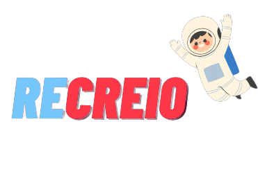

# ReCreio Web Site

<!---Esses são exemplos. Veja https://shields.io para outras pessoas ou para personalizar este conjunto de escudos. Você pode querer incluir dependências, status do projeto e informações de licença aqui--->

  

<!-- Linha adicional de texto informativo sobre o que o projeto faz. Sua introdução deve ter cerca de 2 ou 3 linhas. Não exagere, as pessoas não vão ler. -->
> Buscamos auxiliar crianças 6 a 13 anos de idade a aprimorar e incentivar a pratica de leitura e escrita, através de jogos, aulas e atividades lúdicas e intuitivas, junto aos pais e professores.

### Ajustes e melhorias

O projeto ainda está em desenvolvimento e as próximas atualizações serão voltadas nas seguintes tarefas:

[...]
        
## 💻 Pré-requisitos

Antes de começar, verifique se você atendeu aos seguintes requisitos:
<!---Estes são apenas requisitos de exemplo. Adicionar, duplicar ou remover conforme necessário--->
* Navegador Google Chrome, Edge, Mozzila Fire Fox ou de sua preferencia.

## ☕ Acessando o Site da Recreio

Para acessar o site em produção acesse [aqui](https://squad-61.github.io/Web_Site/).

## 📫 Contribuindo para o Projeto Recreio
<!--- Se o seu README for longo ou se você tiver algum processo ou etapas específicas que deseja que os contribuidores sigam, considere a criação de um arquivo CONTRIBUTING.md separado --->
Para contribuir com o projeto, siga estas etapas:

1. Bifurque este repositório.
2. Crie um branch: `git checkout -b <nome_branch>`.
3. Faça suas alterações e confirme-as: `git commit -m '<mensagem_commit>'`
4. Envie para o branch original: `git push origin <nome_do_projeto> / <local>`
5. Crie a solicitação de pull.

Como alternativa, consulte a documentação do GitHub em [como criar uma solicitação pull](https://help.github.com/en/github/collaborating-with-issues-and-pull-requests/creating-a-pull-request).

## 🤝 Colaboradores

Agradecemos às seguintes pessoas que contribuíram para este projeto:

<table>
  <tr>
    <td align="center">
      <a href="https://github.com/Engeminas">
         
        
          <b>Diego</b>
        
      </a>
    </td>
    <td align="center">
      <a href="https://github.com/Frotas">
         
        
          <b>Guilherme Augusto</b>
        
      </a>
    </td>
    <td align="center">
      <a href="https://github.com/Guimillen">
         
        
          <b>Guilherme Millen</b>
        
      </a>
    </td>
    <td align="center">
      <a href="https://github.com/GabrielArthu">
         
        
          <b>Gabriel Arthur</b>
        
      </a>
    </td>
    <td align="center">
      <a href="https://github.com/niasbezerra">
         
        
          <b>Josenias Bezerra</b>
        
      </a>
    </td>
    <td align="center">
      <a href="https://github.com/lcoa84">
         
        
          <b>Luiz Almeida</b>
        
      </a>
    </td>
        <td align="center">
      <a href="https://github.com/rebecafrutuoso">
         
        
          <b>Rebeca Costa</b>
        
      </a>
    </td>
  </tr>
</table>

## 😄 Seja um dos contribuidores 

Quer fazer parte desse projeto? Clique [AQUI](CONTRIBUTING.md) e leia como contribuir.

## 📝 Licença

Esse projeto está sob licença. Veja o arquivo [LICENÇA](LICENSE.md) para mais detalhes.

[⬆ Voltar ao topo](#recreio-web-site) 
